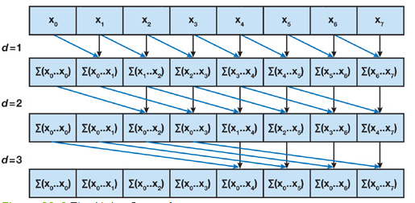
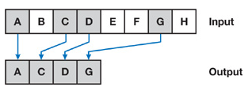
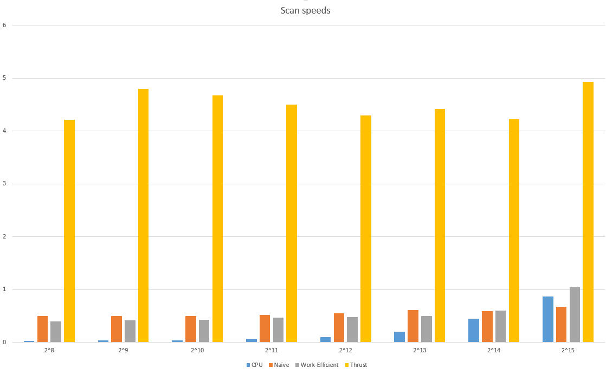

**University of Pennsylvania, CIS 565: GPU Programming and Architecture,
Project 2 - Stream-Compaction**

* Henry Zhu
  * [Github](https://github.com/Maknee), [LinkedIn](https://www.linkedin.com/in/henry-zhu-347233121/), [personal website](https://maknee.github.io/), [twitter](https://twitter.com/maknees1), etc.
* Tested on: Windows 10 Home, Intel i7-4710HQ @ 2.50GHz 22GB, GTX 870M (Own computer)

## Scanning and stream-compaction 


### What is scanning/stream-compaction

Scanning (prefix sum) is summing all the values from previous indices into the current index. The image below from [GPU Gems](https://developer.nvidia.com/gpugems/GPUGems3/gpugems3_ch39.html) depicts how scan works:



Stream compaction is the removal of a particular value from an array. The image below from [GPU Gems](https://developer.nvidia.com/gpugems/GPUGems3/gpugems3_ch39.html) depicts how stream compaction works:



## Answer to Questions

### Performance of scan speeds (Array sizes)



### To guess at what might be happening inside the Thrust implementation (e.g. allocation, memory copy), take a look at the Nsight timeline for its execution. Your analysis here doesn't have to be detailed, since you aren't even looking at the code for the implementation.

The thrust implementation is much better optimized for larger instances. It does not, however, work well with small array sizes.
This is most likely due to its implementation. It takes in consideration a better block size for a larger amount of elements to scan through, so that is why it is much better in performance for larger numbers.

### Can you find the performance bottlenecks? Is it memory I/O? Computation? Is it different for each implementation?

I did find performance bottlenecks. I think, at least for the work efficient implementation of scan, it might be memory I/O as one has to send data to the GPU and then send it back for each iteration of d. For CPU, as shown in the graph below, it has to be with the computation as it has to iterate through every single node. The work-efficient implementation beats the naive implementation at first, but later, the naive implementation beats the work-efficient implementation as the memory i/o overhead becomes much larger than the computation overhead. 

## Output of program

```
****************
** SCAN TESTS **
****************
    [  24  39   5   4   7  25  26  45  30  32  42  22  35 ...  19   0 ]
==== cpu scan, power-of-two ====
   elapsed time: 0.865021ms    (std::chrono Measured)
    [   0  24  63  68  72  79 104 130 175 205 237 279 301 ... 801298 801317 ]
==== cpu scan, non-power-of-two ====
   elapsed time: 0.826429ms    (std::chrono Measured)
    [   0  24  63  68  72  79 104 130 175 205 237 279 301 ... 801241 801278 ]
    passed
==== naive scan, power-of-two ====
   elapsed time: 0.67424ms    (CUDA Measured)
    [   0  24  63  68  72  79 104 130 175 205 237 279 301 ... 801298 801317 ]
    passed
==== naive scan, non-power-of-two ====
   elapsed time: 1.50448ms    (CUDA Measured)
    passed
==== work-efficient scan, power-of-two ====
   elapsed time: 1.03907ms    (CUDA Measured)
    [   0  24  63  68  72  79 104 130 175 205 237 279 301 ... 801298 801317 ]
    passed
==== work-efficient scan, non-power-of-two ====
   elapsed time: 0.866112ms    (CUDA Measured)
    passed
==== thrust scan, power-of-two ====
   elapsed time: 4.9281ms    (CUDA Measured)
    passed
==== thrust scan, non-power-of-two ====
   elapsed time: 0.254016ms    (CUDA Measured)
    passed

*****************************
** STREAM COMPACTION TESTS **
*****************************
    [   0   3   1   0   1   1   2   1   0   2   0   2   3 ...   1   0 ]
==== cpu compact without scan, power-of-two ====
   elapsed time: 0.12029ms    (std::chrono Measured)
    [   3   1   1   1   2   1   2   2   3   1   1   3   1 ...   3   1 ]
    passed
==== cpu compact without scan, non-power-of-two ====
   elapsed time: 0.11988ms    (std::chrono Measured)
    [   3   1   1   1   2   1   2   2   3   1   1   3   1 ...   1   1 ]
    passed
==== cpu compact with scan ====
   elapsed time: 1.28747ms    (std::chrono Measured)
    [   3   1   1   1   2   1   2   2   3   1   1   3   1 ...   3   1 ]
    passed
==== work-efficient compact, power-of-two ====
   elapsed time: 1.34822ms    (CUDA Measured)
    [   3   1   1   1   2   1   2   2   3   1   1   3   1 ...   3   1 ]
    passed
==== work-efficient compact, non-power-of-two ====
   elapsed time: 1.15571ms    (CUDA Measured)
    [   3   1   1   1   2   1   2   2   3   1   1   3   1 ...   1   1 ]
    passed
```


